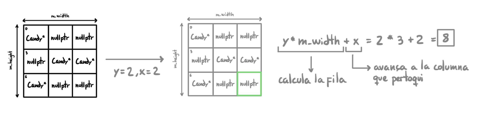
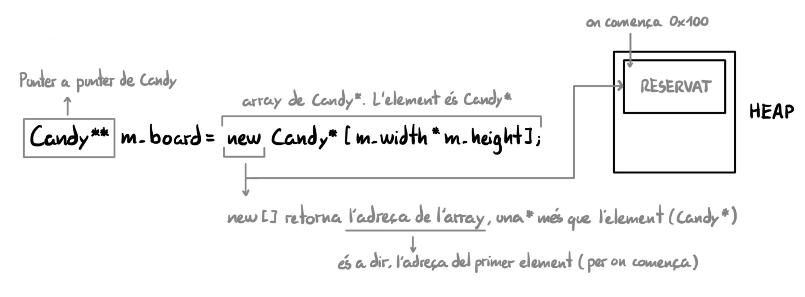

# Cambios Respecto a la Primera Entrega

## Board.h - Estructura

### Cambio de tipo en m_candyStorage:
Antes teniamos `vector<Candy>` que guardaba objetos por valor. Ahora usamos `vector<Candy*>` que guarda punteros a los caramelos creados con `new`.

### Metodos nuevos añadidos (public):
- `Board(const Board& b)` **constructor de copia**: Este constructor se llama cuando realizamos `Board b2 = b1;` o `Board b2(b1);`. Delegamos el trabajo a un metodo externo `copyFrom()` que realiza 3 cosas:

    - Copia las dimensiones de b1 (`m_width`, `m_height`).
    - Reserva un array nuevo para b2 (no comparte el de b1).
    - Crea nuevos candies copiados de los de b1, y los pone en su array.

    El resultado es que b2 tendrá exactamente los mismos datos que b1, pero en memoria separada. Si borramos b1, b2 sigue funcionando. Si modificamos b2, b1 no cambia.

- `Board& operator=(const Board& b)` **operador de asignación**: hace lo mismo que el constructor de copia, pero para un Board que ya existia con su propia memoria. Se llama cuando hacemos:
    ```cpp
    Board b1, b2;
    b2 = b1;
    ```
    Como b2 ya tenia su propia memoria, primero hace falta liberarla con `clear();` (metodo que explicaremos mas adelante) antes de copiar los datos del nuevo, que seria b1.

    Por lo tanto, se hacen 4 cosas:
    - Comprobamos que no haya **auto-asignación**: es decir, `b2 = b2`. Si no lo hicieramos, en caso de copiarse a si mismo, estariamos borrando la memoria de b2 con `clear()` y despues intentariamos copiar de b2, pero ya estaría borrado.
    - **Liberamos la memoria de b2** con `clear()`: así evitamos un leak, es decir, si no usamos el `clear()`y asignamos memoria nueva, la antigua de b2 quedaria abandonada y ocupada sin uso alguno.
    - **Copiamos los datos de b1** con `copyFrom(b)`, creando un nuevo array y nuevos candies.
    - Devolvemos `*this` para poder encadenar `=`, en caso de que hicieramos `b1 = b2 = b3`.

### Metodos nuevos añadidos (private):

- `void init()`: se encarga de crear el tablero vacio. Reserva con `new[]` un array de 100 celdas en el heap y las pone todas a `nullptr`. Se llama al constructor y al `load`(cada vez que hace falta un tablero nuevo y vacio).

- `clear()`: se encarga de destruir el tablero. Recorre `m_candyStorage` y hace `delete`de cada candy que el Board ha creado. Después vacia el vector y hace `delete[]`del array. Se llama al destructor y al `load`(para limpiar el estado anterior).

- `copyFrom(const Board& b)`: se encarga de copiar un Board. Copia las dimensiones, llama a `init()` para crear un nuevo array, y por cada celda no vacia crea un candy nuevo independiente con `new Candy(...)`. Se llama en el constructor de copia y en el `operator=`.

## Board.cpp - Metodos nuevos

- **Constructor**: ahora llama a `init()`en vez de tener el codigo dentro.

- **Destructor**: ahora llama a `clear()`. Antes estaba vacio sin codigo.

- `init()`:
    - `new Candy*[m_width * m_height]` -> reserva el array con el tamaño del tablero.

    - Bucle que pone todo a `nullptr`.

- `clear()`:
    - Bucle `delete candy` por cada candy creado por Board.

    - `m_candyStorage.clear()` elimina todas las entradas del vector, lo deja vacio con tamaño 0, es decir, quita los punteros para que no queden referencias a memoria "muerta".

    - `delete[] m_board` libera el array (la memoria ocupada por el).

- `copyFrom(const Board& b)`:
    - Copia las dimensiones del tablero que copiamos (b), llama a `init()`, y por cada celda no vacia hace `new Candy(*b.m_board[i])`.

- **Contructor de copia**: nuevo, llama a `copyFrom(const Board& b)`.
- **Operador de asignación**: nuevo, comprueba `this != &b`, llama a `clear()` y `copyFrom(b)`. `this` es el puntero al propio objeto que llama al metodo.

## Board.cpp - Cambios de sustitución

En todas las funciones `setCell`, `shouldExplode`, `explodeAndDrop`, `dump`, se ha sustituido `m_cells[y][x]` por `m_board[y * m_width + x]`. Este cambio se ha realizado porque en la primera entrega el tablero era un `vector<vector<Candy*>>` de dos dimensiones, y se accedia por `m_cells[y][x]`. 

En la segunda entrega lo hemos cambiado por un array dinamico de una dimension `Candy** m_board`, que para acceder a la celda (x, y) dentro de una sola fila usamos la formula `y * m_width + x`:


Explicación de `Candy** m_board = new Candy*[m_width * m_height];` en el metodo `setCell()`:


## Board.cpp - load (reescritura completa)

### Eliminado:

- `m_cells.assign(...)`: reinicialización del vector de dos dimensiones que teniamos.
- `m_candyStorage.clear()` + `m_candyStorage.reserve(...)`.
- `m_cells[y][x] = nullptr`: caso en el que encontrabamos un punto en el fichero.
- `m_candyStorage.push_back(Candy(...))` + `m_cells[y][x] = &m_candyStorage.back()`: guardar por valor.

### Añadido:

- `clear()`: limpia el estado del anterior tablero.
- `init()`: reserva un nuevo array.
- `new Candy(charToType(c))`: por cada letra del fichero, crea un candie nuevo en el heap con el tipo de candie correspondiente. Antes se creaba por valor en el `m_candyStorage`, ahora se crea dinamicamente.
- `m_board[y * m_width + x] = newCandy`: guarda la dirección del nuevo candie en la celda correspondiente del tablero.
- `m_candyStorage.push_back(newCandy)`: añade el puntero a la lista de candies propios para que el destructor i el `clear()` sepan cuales borrar y cuales no.
- `if (c != '.')`: simplificación respecto al codigo anterior que tenia:

    ```cpp
    if (c == '.')
    {
        m_cells[y][x] = nullptr;
    }
    else
    {
        m_candyStorage.push_back(Candy(charToType(c)));
        m_cells[y][x] = &m_candyStorage.back();
    }
    ```

    Ahora para esta entrega queda:

    ```cpp
    if (c != '.')
    {
        Candy* newCandy = new Candy(charToType(c));
        m_board[y * m_width + x] = newCandy;
        m_candyStorage.push_back(newCandy);
    }
    ```

    El caso `.` ya no es necesario porque `init()` ya ha puesto todas las celdas a `nullptr` previamente:

    ```cpp
    clear();
    file >> m_width >> m_height;
    init();

    for (int y ...)
    {
        if (c != '.')
        {
            // Solo actua si hay un candie
        }
        // Si es '.', la celda ya era nullptr, no hace falta hacer nada
    }
    ```


